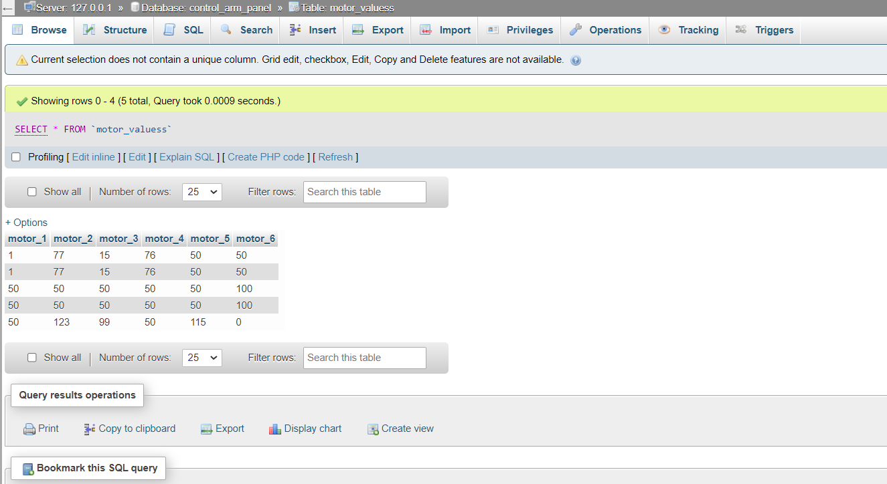
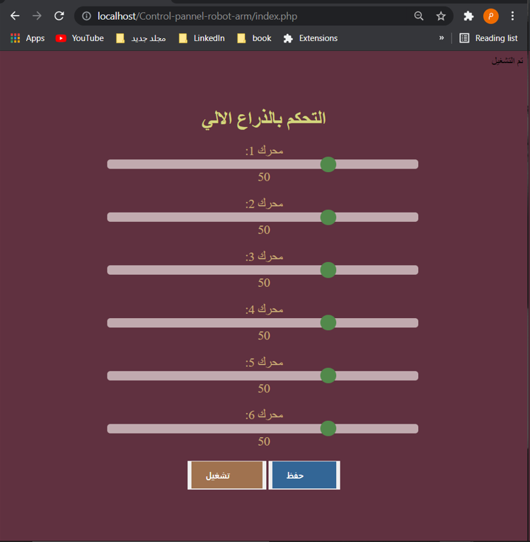
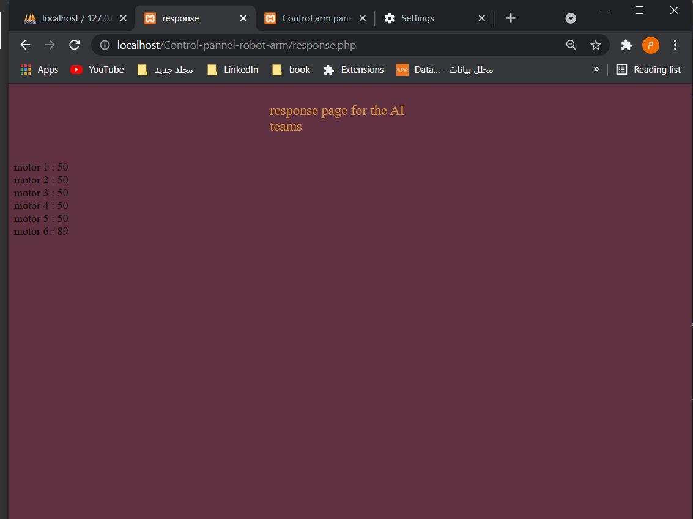

# لوحة تحكم بذراع الية

هذا المشروع جزء من المهام المطلوبة في التدريب على رأس العمل في شركة الاساليب الذكية.
## فكرة المشروع 
صفحة ويب للتحكم بذراع اليه عن بعد باستخدام تقنيات انترنت الاشياء

## المحتويات 
* صفحة لاستقبال مدخلات المستخدم
* قاعدة البيانات 
* صفحة لعرض البيانات من قاغدة البيانات 

### قاعدة البيانات

تحتوي قاعدة البيانات على جدول يحتوي سته اعمدة على عدد المحركات لتخزين قيمتها المدخلة 

### واجهة أدخال البيانات
تحتوي على زر تشغيل لتشغيل الروبوت وسلايدر لكل محرك سلايدر خاص به النطاق من 0 الى 180 و زر اخر لحفظ قيمة المدخلات وارسالها لقاعدة البيانات  

### عرض اخر قيمة ادخلت لقاعدة البيانات
تأتي فائدة هذه الصفحة لعرض اخر قيمة تم ادخالها لقاعدة البيانات وتكمن اهميتها في ربط القاعدة مع الهاردوير

### آليه العمل

لنستطيع التحكم بالذراع نضغط على زر التشغيل اولا , ثم نختار قيم المحركات بعد الضغط على حفظ سيتم ارسال البيانات لقاعدة البيانات  وتخزينها , لسحب اخر قيمة تم ارسالها لقاعدة البيانات نستخدم صفحة ال response 

### تحسينات سيتم العمل عليها 
دمج هذا المشروع مع 

في مشروع واحد 

